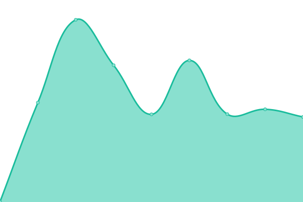
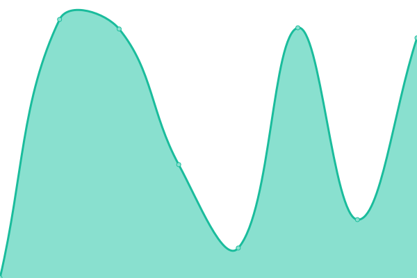
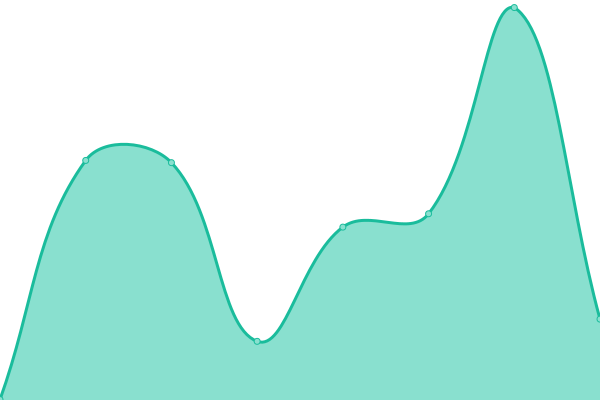
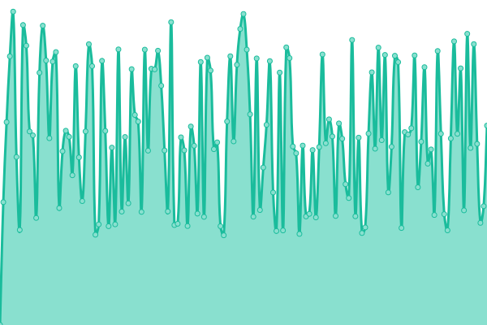

# [📈 Live Status](https://statmon.valdi-via.com): <!--live status--> **🟩 All systems operational**

This repository contains the open-source uptime monitor and status page for [ᴮᴿᴬᴺᴰᴼᴺ](valdi-via.com), powered by [Upptime](https://github.com/upptime/upptime).

With [Upptime](https://upptime.js.org), you can get your own unlimited and free uptime monitor and status page, powered entirely by a GitHub repository. We use [Issues](https://github.com/chillwave/uptime.valdi-via/issues) as incident reports, [Actions](https://github.com/chillwave/uptime.valdi-via/actions) as uptime monitors, and [Pages](https://statmon.valdi-via.com) for the status page.

<!--start: status pages-->
<!-- This summary is generated by Upptime (https://github.com/upptime/upptime) -->
<!-- Do not edit this manually, your changes will be overwritten -->
<!-- prettier-ignore -->
| URL | Status | History | Response Time | Uptime |
| --- | ------ | ------- | ------------- | ------ |
|  [Dump1090 South Florida](http://119xx.valdi-via.com:11090) | 🟩 Up | [dump1090-south-florida.yml](https://github.com/Chillwave/uptime.valdi-via/commits/HEAD/history/dump1090-south-florida.yml) | 

 605ms
     
 | 

<a href="https://statmon.valdi-via.com/history/dump1090-south-florida">94.16%</a>
    

|  [Florida Power & Light - Outage Map](https://www.fplmaps.com/) | 🟩 Up | [florida-power-and-light-outage-map.yml](https://github.com/Chillwave/uptime.valdi-via/commits/HEAD/history/florida-power-and-light-outage-map.yml) | 

 152ms
     
 | 

<a href="https://statmon.valdi-via.com/history/florida-power-and-light-outage-map">100.00%</a>
    

|  [Duke Energy (FL)- Outage Map](https://outagemaps.duke-energy.com/#/current-outages/fl) | 🟩 Up | [duke-energy-fl-outage-map.yml](https://github.com/Chillwave/uptime.valdi-via/commits/HEAD/history/duke-energy-fl-outage-map.yml) | 

 901ms
     
 | 

<a href="https://statmon.valdi-via.com/history/duke-energy-fl-outage-map">100.00%</a>
    

|  [AT&T - Outage Map](https://www.att.com/outages) | 🟩 Up | [at-and-t-outage-map.yml](https://github.com/Chillwave/uptime.valdi-via/commits/HEAD/history/at-and-t-outage-map.yml) | 

 582ms
     
 | 

<a href="https://statmon.valdi-via.com/history/at-and-t-outage-map">100.00%</a>
    

|  [Xfinity - Outage Map](https://www.xfinity.com/support/statusmap) | 🟩 Up | [xfinity-outage-map.yml](https://github.com/Chillwave/uptime.valdi-via/commits/HEAD/history/xfinity-outage-map.yml) | 

 809ms
     
 | 

<a href="https://statmon.valdi-via.com/history/xfinity-outage-map">100.00%</a>
    

|  [Verizon - Status](https://verizon.com/CheckStatus) | 🟩 Up | [verizon-status.yml](https://github.com/Chillwave/uptime.valdi-via/commits/HEAD/history/verizon-status.yml) | 

 451ms
     
 | 

<a href="https://statmon.valdi-via.com/history/verizon-status">100.00%</a>
    

|  [Comcast Buisness - Status](https://business.comcast.com/status/) | 🟩 Up | [comcast-buisness-status.yml](https://github.com/Chillwave/uptime.valdi-via/commits/HEAD/history/comcast-buisness-status.yml) | 

 406ms
     
 | 

<a href="https://statmon.valdi-via.com/history/comcast-buisness-status">100.00%</a>
    

|  [Lumen - Account Portal](https://www.lumen.com/login) | 🟩 Up | [lumen-account-portal.yml](https://github.com/Chillwave/uptime.valdi-via/commits/HEAD/history/lumen-account-portal.yml) | 

 438ms
     
 | 

<a href="https://statmon.valdi-via.com/history/lumen-account-portal">100.00%</a>
    

|  [CenturyLink - Account Portal](https://dh.centurylink.com/) | 🟩 Up | [century-link-account-portal.yml](https://github.com/Chillwave/uptime.valdi-via/commits/HEAD/history/century-link-account-portal.yml) | 

 670ms
     
 | 

<a href="https://statmon.valdi-via.com/history/century-link-account-portal">100.00%</a>
    

<!--end: status pages-->

[**Visit our status website →**](https://statmon.valdi-via.com)

## 📄 License

- Powered by: [Upptime](https://github.com/upptime/upptime)
- Code: [MIT](./LICENSE) © [Anand Chowdhary](https://anandchowdhary.com), supported by [Pabio](https://pabio.com)
- Data in the `./history` directory: [Open Database License](https://opendatacommons.org/licenses/odbl/1-0/)
